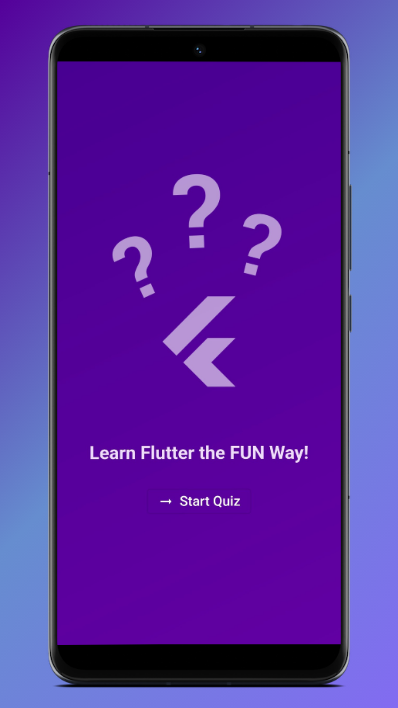
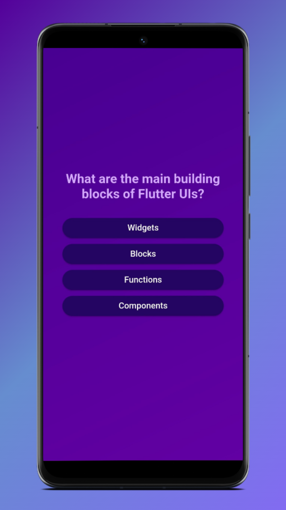
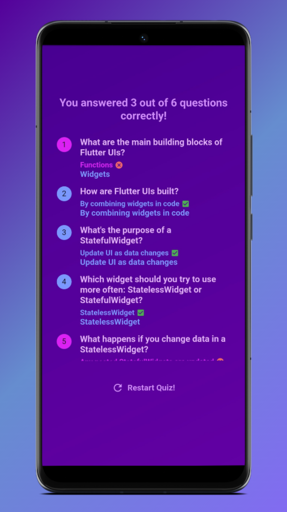

# Quizzo - Quiz App

***A simple Quiz App to test your basic knowledge on Flutter.***

Hi, I am Subarnab Sadhukhan. This is my Second Project on Google Flutter. This Quiz app is Android and Web ready.

*Check out the Web App version:* **[https://qr.subarnab.in/quizzo](https://qr.subarnab.in/quizzo)**
 
> **Note :**  
> I have pushed all the Commits 'as it is'. I built this app when I was learning Flutter. When I learned something new or changed something on this project, I made a Commit. So, most of these Commits are not made according to the concept of Atomic Commit.

## Screenshots

<table width="100%">
  <tbody>
    <tr>
      <td width="1%"></td>
      <td width="1%"></td>
      <td width="1%"></td>
    </tr>
  </tbody>
</table>

## Setup

Step-1: Download or clone this repository -

    git clone https://github.com/subarnabsadhukhan/Quizzo-Quiz-App.git

Step-2: Go to project root and execute the following command in console to get the required dependencies -

    flutter pub get 
    
Step-3: Run flutter project -

    flutter run

## Required Tools
- Android Studio
- Visual Studio Code (Optional)
- Flutter
- Dart

## New to Flutter!

Follow this -

- [Lab: Write your first Flutter app](https://docs.flutter.dev/get-started/codelab)
- [Cookbook: Useful Flutter samples](https://docs.flutter.dev/cookbook)

For help getting started with Flutter development, view the
[online documentation](https://docs.flutter.dev/), which offers tutorials,
samples, guidance on mobile development, and a full API reference.

  

*Feel Free to copy the code and use it. Don't forget to star the repo.*